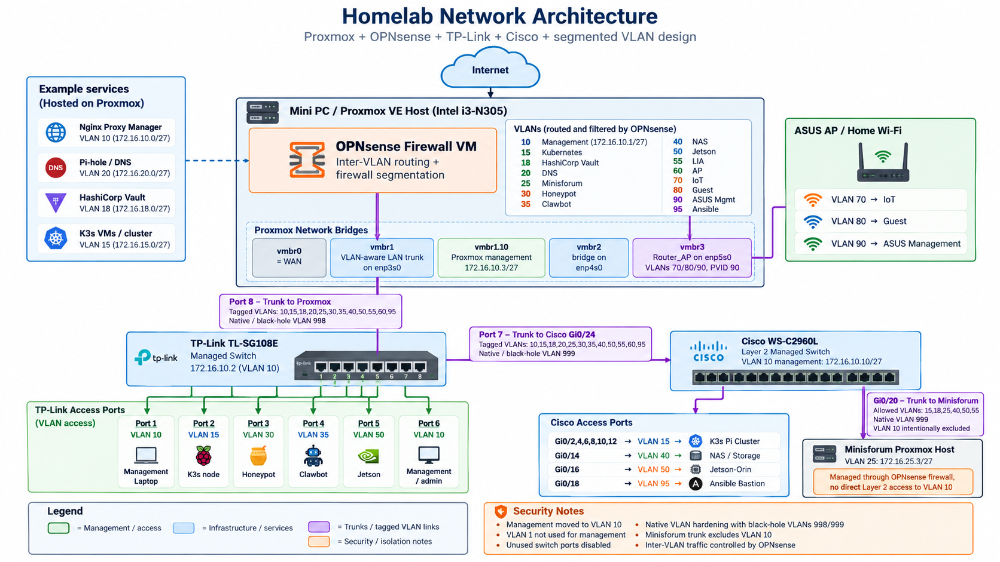

# Homelab Security Portfolio

En portfölj som samlar mina praktiska projekt inom **IT-säkerhet, nätverk, virtualisering och infrastruktur**.

Miljön bygger på ett eget homelab där jag arbetar med bland annat:

- Proxmox VE
- OPNsense
- Cisco-switching
- VLAN-segmentering
- Kubernetes / K3s
- HashiCorp Vault
- Pi-hole
- Nginx Proxy Manager
- Ansible
- NAS / lagring
- Säkerhetshärdning och felsökning

Syftet med portföljen är att visa praktisk erfarenhet av att bygga, segmentera, härda och felsöka en mindre IT-infrastruktur.

---

## Fokusområden

Jag arbetar främst med:

- Nätverkssäkerhet
- Firewall och inter-VLAN-regler
- VLAN och 802.1Q trunking
- Management-nätverk
- Least privilege
- Infrastrukturhärdning
- Kubernetes / K3s
- Linux och Proxmox
- Automation med Ansible
- Dokumentation och felsökning

---

## Network Security Lab

Nätverket är segmenterat i flera VLAN med **OPNsense som central brandvägg och router**.

Exempel på säkerhetsåtgärder:

- Dedikerat management-VLAN
- VLAN 1 borttaget från management
- Native VLAN hardening
- Black-hole VLAN 998/999
- Begränsade trunkar
- Oanvända switchportar shutdown
- Firewall-regler baserade på least privilege
- Separation mellan management, Kubernetes, NAS, IoT, Guest och andra tjänster

### Dokumentation

- [Network Architecture](docs/architecture.md)
- [VLAN Design](docs/vlan-design.md)
- [Firewall Segmentation](docs/firewall-segmentation.md)
- [Network Hardening](docs/hardening.md)
- [Troubleshooting](docs/troubleshooting.md)

---

## Example Configuration

Sanerade exempel från miljön finns här:

- [Cisco configuration](configs/cisco-sanitized.txt)
- [Proxmox network configuration](configs/proxmox-network-sanitized.txt)
- [OPNsense firewall rules](configs/opnsense-rules-example.md)

Känslig information som lösenord, API-nycklar, privata certifikat och autentiseringsuppgifter är borttagen.

---

## Network Architecture

---

## Screenshots

Exempel på verifiering från labbmiljön:

- Cisco trunk och VLAN-hardening
- Proxmox VLAN-konfiguration
- OPNsense firewall-regler
- Segmentering mellan olika säkerhetszoner

---

## Exempel på teknik i miljön

| Område | Teknik |
|---|---|
| Firewall | OPNsense |
| Virtualisering | Proxmox VE |
| Switching | Cisco WS-C2960L, TP-Link TL-SG108E |
| Containers | LXC, Docker |
| Kubernetes | K3s |
| Secrets | HashiCorp Vault |
| DNS | Pi-hole |
| Reverse Proxy | Nginx Proxy Manager |
| Automation | Ansible |
| Storage | NAS / NFS / SMB |
| AI / Edge | NVIDIA Jetson |

---

## Vad jag tränar på

Jag använder homelabbet för att praktiskt träna på:

- bygga säkra nätverksarkitekturer
- konfigurera brandväggar
- segmentera nätverk med VLAN
- felsöka nätverksproblem
- arbeta med Linux-servrar
- administrera Kubernetes
- automatisera system
- dokumentera tekniska lösningar

---

## Syfte

Portföljen är skapad som en del av min utveckling inom **IT-säkerhet** och för att visa praktiska projekt inför **LIA och framtida arbete inom IT- och nätverkssäkerhet**.
